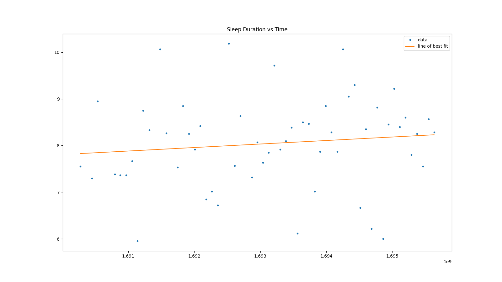
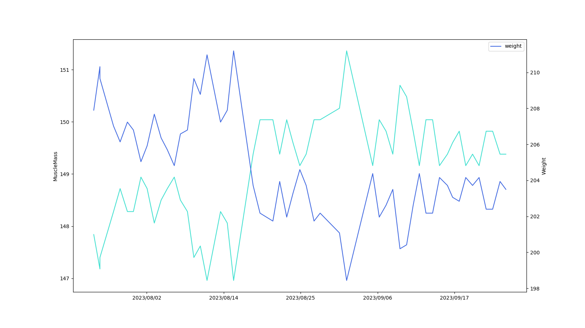

# Tacking My Health
This is a project I want to do as a way to keep track of various health metrics, it is a way I can get insights about my health

## Equipment
I use a Samsung Galaxy Watch 5 to keep track of a lot of data about myself (sleep, hr, exercise, etc.), and I use a scale with a bluetooth app to weigh myself every morning.

## Data/Insights
This report was written with data from Sep. 25th and before

###### Sleep duration Vs. Time

###### Sleep duration Vs. Day of the Week

###### Weight vs. Time
