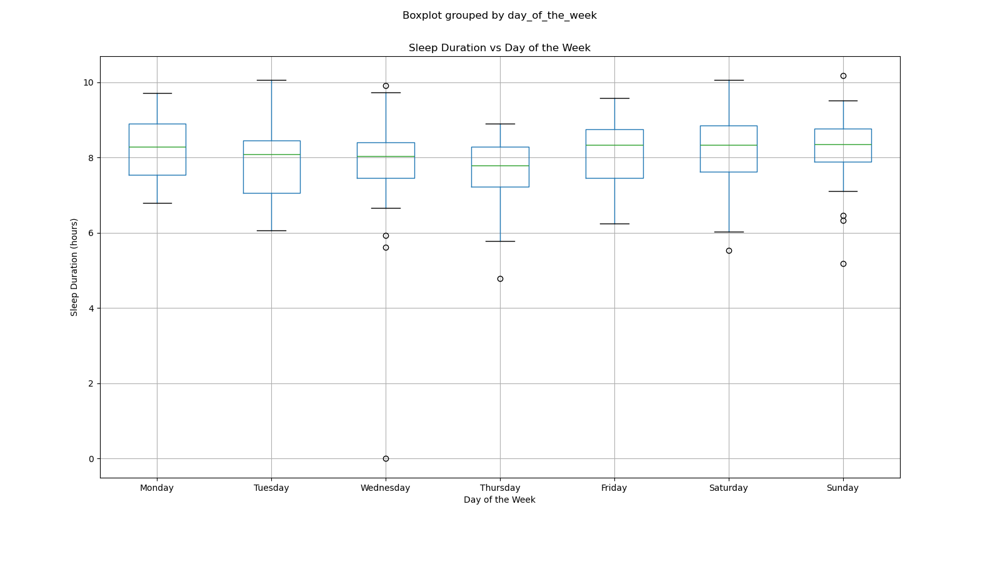
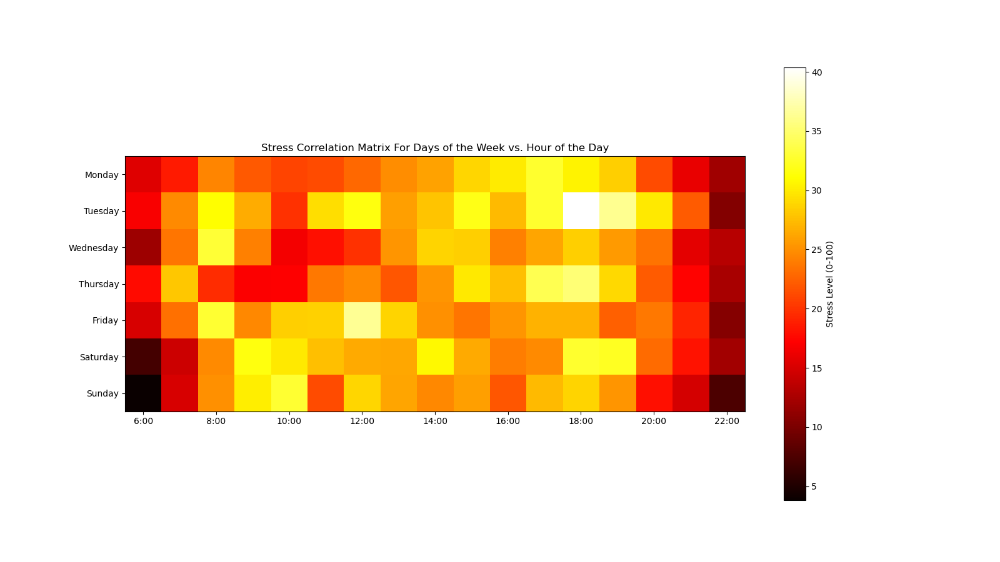

# Health Data Analysis
This is a project I want to do as a way to keep track of various health metrics, it is a way I can get insights about my health

## Equipment
I use a Samsung Galaxy Watch 5 to keep track of a lot of data about myself (sleep, hr, exercise, etc.), and I use a scale with a bluetooth app to weigh myself every morning.

## Data/Insights
This report was written with data from Sept. 4-28 

Sleep average of 8 hours 20 minutes per day (increasing trend)
The days with the highest average stress (Monday and Thursday) surprised me, Thursday makes sense because I have the most classes on those days, but I do not understand Mondays.

###### How I spend my time
.png)

###### Sleep duration Vs. Time
_vs._time.png)

###### Sleep duration Vs. Day of the Week

###### Weight vs. Time

###### Stress Vs. Day of the Week

###### Stress Vs. Hour

###### Stress. Vs. Day of the Week Correlation Matrix

##### Computer Usage vs. Day of the Week
