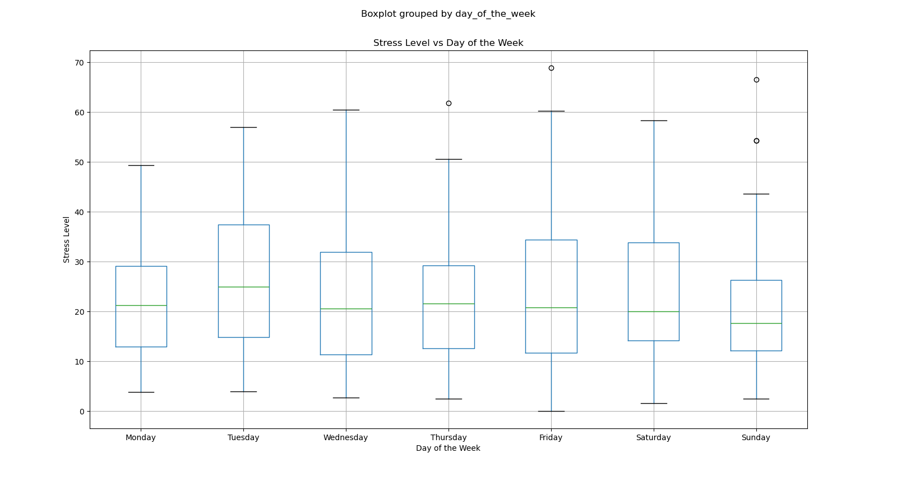

# Health Data Analysis
In this project I will analyze a lot of data about myself and use that to track my progress (like how my cut is going) and to figure out how I can improve my health and my life.

## Equipment
This is a project that will analyze data from a variety of sources, from my smartwatch (for health-related metrics like sleep, steps walked, hr, etc.) from my phone (used for my location log and to log my weight-training sessions), from my google calendar (to get an idea of how I spend my time), and computer (to understand when and how frequently I use my computer)

## Data/Insights
This report was written with data from 2023/09/04 to 2023/10/30 (a total of 57 days).

###### Weight (& average weight loss per day) vs. time

###### How I spend my time
.png)

###### Sleep duration Vs. Time
_vs._time.png)

###### Sleep duration Vs. Day of the Week

###### Weight vs. Time

###### Stress Vs. Day of the Week

###### Stress Vs. Hour

###### Stress. Vs. Day of the Week Correlation Matrix

##### Computer Usage vs. Day of the Week

